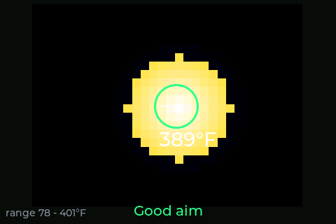

# PanPilot

A hands-free infrared **pan-temperature monitor and cooking coach**. A thermal
camera watches your pan from a mount above the stove; a bright touchscreen shows
the real surface temperature, predicts overshoot before it happens, and tells you
exactly when to turn the heat down, flip, or add the next batch — no probes, no
instrumented cookware, no phone.

> **Status: M0 (board bring-up).** This README grows one section at a time as each
> milestone lands. Sections below marked _(coming in M#)_ aren't built yet.

<p align="center">
  
</p>

> 🖼️ **UI images are synthesized placeholders** — rendered by the LVGL
> simulator (`python scripts/screenshots.py`), not photos of a real panel. They
> show the actual on-device layout and will be swapped for device photos once
> the hardware is in hand. New screens appear here as each milestone lands.

---

## 1. What PanPilot is

PanPilot points a **MLX90640 32×24 thermal array** at your pan and turns what it
sees into plain guidance. Because it measures the *whole pan* (not a single spot)
it can tell a pan from a hand from an empty burner, follow the temperature as you
cook, and — the flagship trick — **predict the peak** a ramp is heading for and
warn you *before* you blow past your target.

It runs in two forms from one firmware:

- **Stovetop Advisor** — mounted over any stove (gas, electric, induction). It
  coaches: “TURN TO MEDIUM”, “FLIP”, “READY”, with screen flashes and buzzer
  patterns, and even checks that you actually turned the knob. _(guidance: M3+)_
- **Griddle Autopilot** — with the optional PanPilot SSR box inline to an electric
  griddle, it holds the temperature itself. _(Phase 3: M14+)_

No accounts, no cloud, works fully offline. Wi-Fi (M8+) is a convenience layer.

## 2. Hardware

**Primary build (this repo's verified target):**

| Part | Notes |
|---|---|
| **Elecrow CrowPanel Advance 3.5″ HMI** | ESP32-S3-WROOM-1-N16R8, 480×320 IPS, GT911 capacitive touch, onboard buzzer |
| **MLX90640 thermal array — BAB (55°×35° FOV)** | I²C; best pixel use at 24–36″ mounting _(wired in M1)_ |
| Mount / arm | positions the sensor head above the cooktop, aimed down at the pan |

The 3.5″ **basic** (ESP32-WROVER) board is a secondary target; its pins are
unverified in this build. CrowPanel Advance **5″** variants are planned targets
(their pin maps are captured in `include/board_pins.h`).

**Wiring (MLX90640 → CrowPanel Advance I²C):** _(documented in M1 when the sensor
lands — the thermal array shares the GT911 touch I²C bus, SDA=15 / SCL=16.)_

**Enclosure:** _(coming in Phase 2, M-enclosure — parametric OpenSCAD.)_

## 3. Flashing

**Easiest — web flasher (Chrome/Edge):**
👉 **https://jamesdavid.github.io/PanPilot/** — plug the board in over USB-C, pick
your board variant, click Install. The page shows the firmware version.

**From source (PlatformIO):**

```bash
pio run -e crowpanel35_advance -t upload   # Advance 3.5" (ESP32-S3)
pio device monitor                         # serial console @115200
```

> ⚠️ **Safety:** PanPilot is a cooking *aid*, not a substitute for attention.
> Never leave a hot stove unattended. Sections on poultry/ground-meat internal
> temperatures and the SSR box carry safety callouts you should read fully.

---

## 4. First boot & aiming

On boot PanPilot shows the **live thermal view** — exactly what the sensor sees,
false-colored (hot = white/yellow, cool = dark). This replaces a laser dot: aim
by moving the sensor head until the pan sits under the center crosshair.

<p align="center">
  
</p>

- The **green circle** is the region of interest (ROI) locked onto the pan; the
  number is the pan-surface temperature (75th-percentile of the pan interior, so
  a stray flame lick or hot spot doesn't spike the reading).
- The bottom hint reads **“Center the pan in view”** → **“Good aim”** once the
  pan blob is under the crosshair. **“No pan in view”** means nothing pan-like is
  detected.
- **Tap the pan** to lock the ROI there; the **Auto** button returns to
  auto-follow. _(tap-to-lock interaction: bench-tested at M1.)_

> _Synthesized simulator image; a device photo replaces it once the MLX90640 is
> wired and aimed at a real pan._

**Confidence:** every screen shows a confidence indicator. Bare stainless reads
low and reflective, so PanPilot caps confidence and leans on the temperature
*trend* rather than the absolute number (add oil/water for a true reading).
## 5. Modes: Thermometer, Target Assist, Presets _(coming in M2–M4)_
## 6. Food timer & cook database _(coming in M12.5)_
## 7. Attention levels — beep & flash patterns _(coming in M13)_
## 8. Learn Pan Mode _(coming in M6)_
## 9. Web interface & Recipe Creator _(coming in M8 / M20)_
## 10. Home Assistant integration _(coming in M9)_
## 11. Autopilot & the SSR box _(coming in M14+)_
## 12. Troubleshooting & FAQ _(grows per milestone)_

---

## 13. Developer appendix

- **Specs** (authoritative, read-only): `specs/panpilot-firmware-spec.md` (M0–M6),
  `specs/panpilot-phase2-to-ultimate-spec.md` (M7+). Working agreements: `CLAUDE.md`.
- **Layout:** `include/` (board pins, config, LVGL config), `src/hal` (display,
  touch, buzzer), `src/ui` (LVGL screens), `src/core` (hardware-free, unit-tested
  logic — grows M1+), `src/sensor` (thermal pipeline — M1+), `test/` (native
  Unity tests), `sim/` (LVGL SDL simulator — M0+), `scripts/`, `web/` (flasher).
- **Build & test:**
  ```bash
  pio run -e crowpanel35_advance     # firmware
  pio test -e native                 # host unit tests (runs in CI)
  ```
  Native tests run locally (MinGW-w64 GCC) and in CI; CI additionally renders
  the simulator screenshots.
- **Hardware bring-up checklist:** `HARDWARE_TEST.md`.
