# PanPilot

A hands-free infrared **pan-temperature monitor and cooking coach**. A thermal
camera watches your pan from a mount above the stove; a bright touchscreen shows
the real surface temperature, predicts overshoot before it happens, and tells you
exactly when to turn the heat down, flip, or add the next batch — no probes, no
instrumented cookware, no phone.

> **Status: roadmap complete — M0-M21 (live control hardware-gated).** This README grows one
> section at a time as each milestone lands. Sections below marked _(coming in
> M#)_ aren't built yet.

<p align="center">
  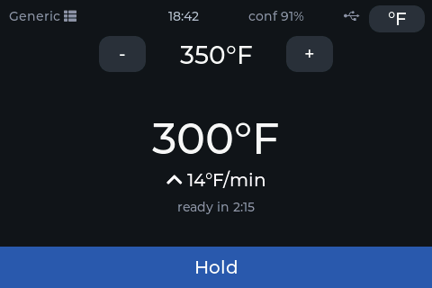
</p>

> 🖼️ **UI images are synthesized placeholders** — rendered by the LVGL
> simulator (`python scripts/screenshots.py`), not photos of a real panel. They
> show the actual on-device layout and will be swapped for device photos once
> the hardware is in hand. New screens appear here as each milestone lands.

---

## 1. What PanPilot is

PanPilot points a **MLX90640 32×24 thermal array** at your pan and turns what it
sees into plain guidance. Because it measures the *whole pan* (not a single spot)
it can tell a pan from a hand from an empty burner, follow the temperature as you
cook, and — the flagship trick — **predict the peak** a ramp is heading for and
warn you *before* you blow past your target.

It runs in two forms from one firmware:

- **Stovetop Advisor** — mounted over any stove (gas, electric, induction). It
  coaches: “TURN TO MEDIUM”, “FLIP”, “READY”, with screen flashes and buzzer
  patterns, and even checks that you actually turned the knob. _(guidance: M3+)_
- **Griddle Autopilot** — with the optional PanPilot SSR box inline to an electric
  griddle, it holds the temperature itself. _(Phase 3: M14+)_

No accounts, no cloud, works fully offline. Wi-Fi (M8+) is a convenience layer.

## 2. Hardware

**Primary build (this repo's verified target):**

| Part | Notes |
|---|---|
| **Elecrow CrowPanel Advance 3.5″ HMI** | ESP32-S3-WROOM-1-N16R8, 480×320 IPS, GT911 capacitive touch, onboard buzzer |
| **MLX90640 thermal array — BAB (55°×35° FOV)** | I²C; best pixel use at 24–36″ mounting _(wired in M1)_ |
| Mount / arm | positions the sensor head above the cooktop, aimed down at the pan |

The 3.5″ **basic** (ESP32-WROVER) board is a secondary target; its pins are
unverified in this build. CrowPanel Advance **5″** variants are planned targets
(their pin maps are captured in `include/board_pins.h`).

**Wiring (MLX90640 → CrowPanel Advance I²C):** _(documented in M1 when the sensor
lands — the thermal array shares the GT911 touch I²C bus, SDA=15 / SCL=16.)_

**Enclosure:** _(coming in Phase 2, M-enclosure — parametric OpenSCAD.)_

## 3. Flashing

**Easiest — web flasher (Chrome/Edge):**
👉 **https://jamesdavid.github.io/PanPilot/** — plug the board in over USB-C, pick
your board variant, click Install. The page shows the firmware version.

**From source (PlatformIO):**

```bash
pio run -e crowpanel35_advance -t upload   # Advance 3.5" (ESP32-S3)
pio device monitor                         # serial console @115200
```

**Updates (M10):** once on Wi-Fi, update over the air from a browser at
**http://panpilot.local/update** — no cable. PanPilot uses a **dual-app
partition** and **auto-reverts** to the previous firmware if a new image
boot-loops (3 failed boots), so a bad update can't brick it.

> ⚠️ **Safety:** PanPilot is a cooking *aid*, not a substitute for attention.
> Never leave a hot stove unattended. Sections on poultry/ground-meat internal
> temperatures and the SSR box carry safety callouts you should read fully.

---

## 4. First boot & aiming

**The very first boot** runs a short setup wizard: a welcome, your temperature
unit (°F/°C), where to mount and aim the sensor, and a "you're all set" screen.
It appears once — a saved flag skips it on every boot after — and you can change
anything later in **Settings**.

<p align="center">
  
</p>

After setup, PanPilot shows the **live thermal view** — exactly what the sensor sees,
false-colored (hot = white/yellow, cool = dark). This replaces a laser dot: aim
by moving the sensor head until the pan sits under the center crosshair.

<p align="center">
  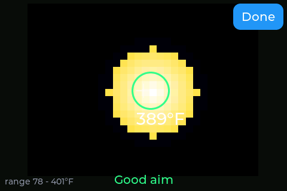
</p>

- The **green circle** is the region of interest (ROI) locked onto the pan; the
  number is the pan-surface temperature (75th-percentile of the pan interior, so
  a stray flame lick or hot spot doesn't spike the reading).
- The bottom hint reads **“Center the pan in view”** → **“Good aim”** once the
  pan blob is under the crosshair. **“No pan in view”** means nothing pan-like is
  detected.
- **Tap the pan** to lock the ROI onto it — on a two-burner scene this pins
  tracking to the pan you tapped even if the other is larger. The **Auto**
  button (top-left, shown while locked) returns to auto-follow; the ROI ring
  turns amber while locked.

> _Synthesized simulator image; a device photo replaces it once the MLX90640 is
> wired and aimed at a real pan._

**Confidence:** every screen shows a confidence indicator. Bare stainless reads
low and reflective, so PanPilot caps confidence and leans on the temperature
*trend* rather than the absolute number (add oil/water for a true reading).
## 5. The home screen: Thermometer & Target Assist

The home screen shows the **smoothed** pan-surface temperature (big numeral), the
**rate of change** with a trend arrow, and — the M3 addition — a **target** with
an ETA and a color-coded **action bar** telling you what to do.

<p align="center">
  
</p>

- **Set a target** with the `–` / `+` buttons (5 °F steps, remembered across
  reboots). PanPilot then guides you to it.
- **Smoothed, not jumpy:** the big number is exponentially smoothed (~2 s); the
  **rate** is a least-squares fit over 10 s (*estimating…* until it has data).
  **ETA** shows *ready in m:ss* while heating.
- **Action bar** (bottom) is the at-a-glance instruction, color-coded:
  **Heat more / Hold** (blue) → **Turn down soon** (amber) →
  **TURN DOWN NOW** (orange) → **READY** (green) → **TOO HOT** (red). It also
  shows *No pan*, *Check aim*, *Cooling*.
- **°F / °C** toggle (top-right). Tap the big temperature for the
  [thermal view](#4-first-boot--aiming).

**Overshoot prediction (the flagship trick):** PanPilot projects where a fast
ramp is heading and calls **TURN DOWN NOW _before_ you overshoot** — not after.

**Full-screen alerts** take over the screen for the loud states so you can read
them across the kitchen, and clear themselves when the condition passes:

<p align="center">
  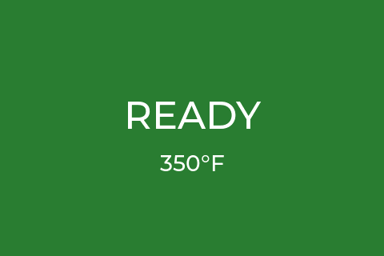
</p>

> _Synthesized simulator images; device photos to follow._

### Presets _(M4)_

Tap the preset name (top-left) to pick a built-in target band instead of dialing
one in. Each preset sets the ready window and the overheat threshold for that
food; nudging `–`/`+` afterward makes it a custom target.

<p align="center">
  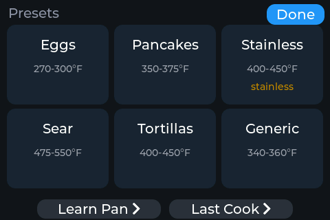
</p>

| Preset | Ready band | Notes |
|---|---|---|
| Eggs | 270–300 °F | gentle |
| Pancakes | 350–375 °F | recovery-monitored (M6) |
| Stainless | 400–450 °F | shows the *bare stainless reads low* banner |
| Sear | 475–550 °F | high heat, warn at 650 °F |
| Tortillas | 400–450 °F | |
| Generic | 340–360 °F | fully adjustable |

> _Synthesized simulator image; device photo to follow._

**Make your own.** The preset grid scrolls, and the last tile is **`+ New`** —
tap it to define a custom preset: name it on the on-screen keyboard, set the
low/high °F band with the steppers, and flag it as a stainless pan if needed.
Custom presets get their own ✎ edit button (with a Delete), sit alongside the
built-ins, and are saved to flash. Up to eight; the warn threshold is derived
automatically (band top + 100 °F, capped at the 650 °F ceiling).

<p align="center">
  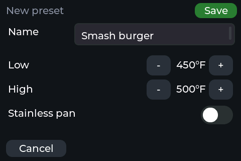
</p>

### Recovery Monitor _(M6)_

For batch cooking (pancakes, smash burgers), recovery-monitored presets watch for
the **temperature drop when food hits the pan**, then track the climb back into
the band and flash **“ADD NEXT BATCH”** with a chime when it's ready — so every
batch starts at the same temperature. If the pan is climbing back too slowly it
says *“Recovery slow — raise heat?”*; too fast, *“watch heat.”*

### Last Cook & history _(M11)_

Every cook is logged (to on-device flash): max temperature, time in range,
overheat seconds, food-added count, plus a 1 Hz temperature trace. The **Last
Cook** screen (from the preset picker) draws the trace as a sparkline:

<p align="center">
  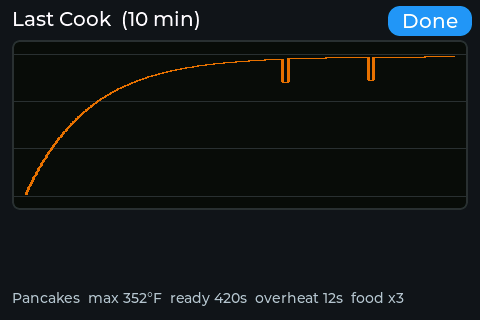
</p>

The [web interface](#9-web-interface-m8) browses the full history and downloads
any cook as **CSV** for a spreadsheet.

### Two pans at once _(M12)_

The array sees two adjacent burners, so PanPilot tracks **both pans** with their
own independent targets and guidance — e.g. eggs at 300 °F on one and a sear at
500 °F on the other, each with its own READY alert. When a second pan appears the
home screen **splits down the middle** into two columns — each with its own
temperature, target, and color-coded action bar (tap a column to set that pan's
target). Each pan stays pinned to its burner frame-to-frame.

**Each pan can run its own cook.** Tap a column → **Cook a food** and that pan
gets its *own* food timer — so one side counts down "FLIP in 0:48" for the eggs
while the other holds a sear. Both timers auto-start on their pan's food-added
drop and cue independently.

<p align="center">
  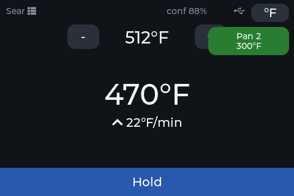
  &nbsp;
  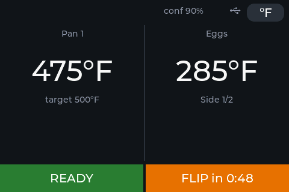
</p>

## 6. Food timer & cook database _(M12.5)_

Presets say *how hot*; the built-in cook database says *how long*. Pick a food
(“Cook a food” on the preset picker) and PanPilot runs a per-side timer that
starts itself, cues flips, and — the differentiator — **compensates for the
actual pan temperature**.

<p align="center">
  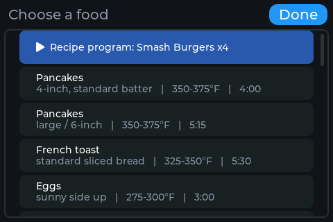
  &nbsp;
  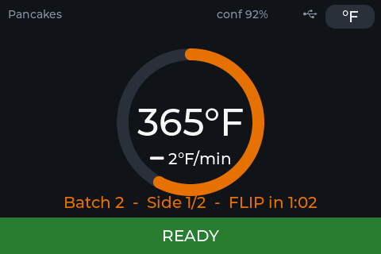
</p>

- **Auto-start on pour:** when PanPilot sees food hit the pan (the temperature
  drop), the side-1 timer starts. A countdown arc wraps the temperature; a line
  shows **Side 1/2**, the **batch** number, and **FLIP / REMOVE in m:ss**.
- **Temperature-compensated (not a wall clock):** the countdown is a *doneness
  accumulator* — a cold pan **visibly stretches** the remaining time (with a
  banner), a hot pan shortens it. A phone timer can't do this.
- **Flip hints:** each food carries a real cue, e.g. *“flip when bubbles pop and
  edges set.”*
- **Food-safety (non-negotiable):** poultry, ground meat, pork and fish show
  **“Surface timing only — verify NNN °F internal”** — thermal surface data can
  never claim internal doneness, and the note can't be dismissed.

The 28-entry seed database (`src/core/foodlib/foodlib_seed.h`) covers breakfast,
burgers, steak, poultry, pork, seafood, melts and vegetarian — authored from
standard references, pending human review before release.

**Add your own foods.** Drop a `/foods.json` on the device filesystem and
PanPilot merges it over the seed at boot: a new *name + variant* adds a food to
the picker, while a matching pair **overrides** the seed values (times, temps,
flip hint) — so you can retune "Pancakes / 4-inch" to your griddle without
touching firmware. See [`docs/foods.example.json`](docs/foods.example.json) for
the schema. The `safeInternalF` field still forces the verify-internal-temp
note and must never be zeroed to quiet the UI.

### It learns your stove

When a cook finishes, PanPilot asks **how it turned out** — *Undercooked /
Perfect / Overcooked*. Each answer nudges that food's timer by **±8%** and
remembers it, so the seed times drift toward *your* burner and pans over a few
cooks. The adjustment is per food **and** variant (4-inch vs 6-inch pancakes are
tracked separately), bounded to 0.6×–1.5× of the original so it can't run away,
and saved to flash.

<p align="center">
  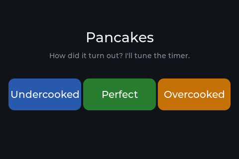
</p>

### Running a recipe program _(M19)_

The food picker's blue **Recipe program** row runs a multi-step cook program
(the built-in is *Smash Burgers x4*; the [Recipe Creator](#recipe-creator-m20)
adds your own). While a program runs, its name replaces the preset in the
top-left, and the **bottom bar becomes the step display — and the button**:

- **Action steps** ("Add 2 patties + smash", "Flip + cheese") show
  **"— tap when done ✓"**: tap the bar to tell PanPilot you did it. Adding food
  is also auto-detected from the temperature drop, so usually the program
  advances by itself. Action steps nag at L2 (beep + strobe) until satisfied.
- **Passive steps** ("Searing side 1", preheat) show a **live countdown**
  (`Searing side 1  1:23`) and chirp **once** on entry — no nagging while the
  pan is just doing its thing.
- The program's hold temperature stays in force between steps — the pan is
  still meant to sit at 450 °F *while* you're searing, and the overheat
  threshold follows the program (clamped by any fat's smoke point).

## 7. Attention levels — beep & flash patterns _(M13)_

Every cue — from a gentle trend tick to a loud alarm — routes through one
attention system with four escalation levels, so the device can reach you whether
you're standing over the pan or across the kitchen:

| Level | Screen | Sound | Used for |
|---|---|---|---|
| **L0** Passive | status text / bar color | silent | trend, HOLD, ETA ticks |
| **L1** Notify | bar pulse | single chirp | READY, food-added ack, recovery done |
| **L2** Act now | full-screen card + **backlight strobe** | double-beep every 5 s | TURN DOWN NOW, ADD BATCH, flip cue |
| **L3** Alarm | full-screen red + strobe | urgent, repeats until cleared | TOO HOT, PLUG ME IN, interlock trips |

- **Mute** silences L0–L2 but **never L3** (a too-hot pan always alarms).
- **Compliance verification (Stovetop Advisor):** after a “TURN DOWN” cue,
  PanPilot watches whether the pan's rate of change actually responds — if you
  turned the knob, it chirps a confirmation; if not, it escalates. The device
  knows whether you actually did the thing it asked.
- The backlight strobe stays under 3 Hz (photosensitivity) and restores your
  brightness afterward.
## 8. Learn Pan Mode

Different pans and burners overshoot by different amounts. **Learn Pan Mode**
(open it from the preset picker) watches a pan heat up for 30 s, measures how fast
it climbs, and stores a **learned thermal lag** so the overshoot prediction is
tuned to *your* pan — not a generic guess.

<p align="center">
  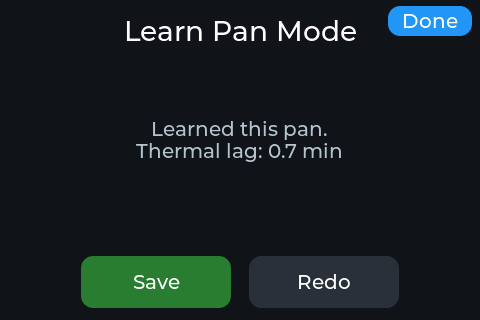
</p>

Tap **Start** with an empty pan on medium heat, leave it, and **Save** the result.
From then on, guidance uses that pan's lag. _(Synthesized simulator image.)_

**Keep up to 8 pans.** Each Save adds a profile (cast iron, nonstick, carbon
steel…); open **My Pans** to switch the active one or delete it. The active
profile's learned lag drives overshoot prediction, so a heavy cast-iron and a
thin nonstick each get guidance tuned to how *they* hold and shed heat.

<p align="center">
  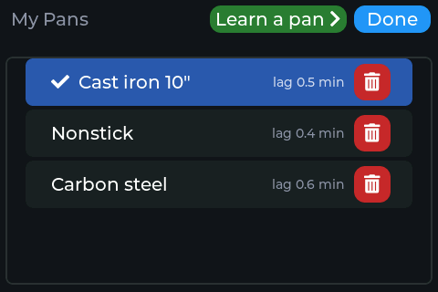
</p>

Each pan row also carries an **SS** chip (tap to mark the pan stainless — the
active pan's material drives the stainless guidance behavior for the whole cook).

**Map Burner (per-pan knob calibration).** "Turn down" cues normally suggest a
knob setting from a generic temperature table. Tap **Map burner** on My Pans to
calibrate the *active pan on your actual burner* instead (~5 minutes): the wizard
walks you through the five knob positions (LOW → HIGH), measuring the heating
rate at each, then one burner-off window to measure how fast the pan sheds heat.
From those six numbers it predicts the **hold temperature of every knob setting**
and shows them before you save. From then on, cues like "aim knob at MED-LOW"
come from *your* burner's map, not the generic table. Maps are per-pan — a thin
nonstick and a cast iron on the same burner get different maps.

### Settings

Open **Settings** from the preset picker's bottom row to change the things that
aren't part of a cook. Tap any row to change it:

- **Temperature** — switch between °F and °C.
- **Sound** — mute or unmute all chimes and alarms.
- **Brightness** — cycle the backlight between **Low / Medium / High**. On
  battery the level is capped so a bright setting still saves power.
- **Time zone** — pick your zone (US Eastern, Central Europe, India, Japan…).
  On the Wi-Fi build PanPilot syncs the clock over **NTP** and shows the time on
  the home screen; the zones carry full DST rules, so it springs forward and
  falls back on its own.
- **Wi-Fi** — shows the connection at a glance: **"tap to set up"** when
  unprovisioned, **"join AP PanPilot-XXXX"** while the setup hotspot is open,
  and **"<your network> — panpilot.local"** once connected (that address is the
  web interface). Tapping the row reopens the setup hotspot for 3 minutes: join
  `PanPilot-XXXX` from your phone, and the captive portal asks for your Wi-Fi
  password (plus the optional MQTT broker and Web PIN).

Every choice is saved to flash and restored on the next boot. The settings list
scrolls, and also holds entries for **Autopilot** and **PID autotune**.

<p align="center">
  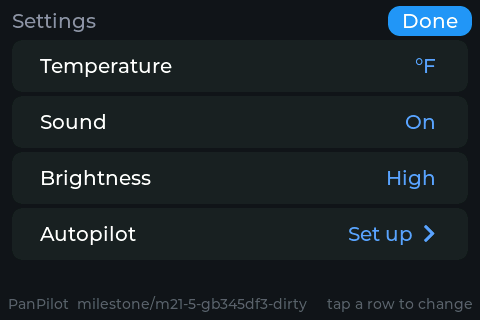
</p>

## 9. Web interface _(M8)_

PanPilot hosts a local web dashboard — no cloud, no account. Join it to your
Wi-Fi once (it opens a **`PanPilot-XXXX`** setup hotspot the first time), then
open **http://panpilot.local/** from any phone or laptop on the same network:

- **Live dashboard** — current temperature, rate, ETA, target, and the
  color-coded action bar, pushed over a WebSocket at 2 Hz.
- **Live thermal view in the browser** — the 32×24 array streamed and rendered
  to a canvas with the same ironbow palette as the device, so you can aim and
  watch the pan from your phone.
- **Settings mirror** at **http://panpilot.local/settings** — change the
  temperature unit, sound, brightness, and time zone from your phone, exactly
  like the on-device Settings screen (with the clock in the header). Set an
  optional **Web PIN** during Wi-Fi setup and edits require it. Changes are
  applied on the device's main loop (never from the web task), so they're safe
  and show up on the panel instantly.

Everything cooking-related keeps working with Wi-Fi off — the web UI is a
convenience mirror. _(Browser screenshot added from a live device; the page is
served from the ESP32 so it can't be rendered by the simulator.)_

### Recipe Creator _(M20)_

At **http://panpilot.local/creator** you build repeatable cook programs in the
browser: pick a food to auto-generate the steps (preheat → add → per-side timers
with flip cues → remove with the safety note), tweak them, **validate**, and
**save** to the device. The **firmware validator is the source of truth** — it
rejects a 700 °F hold, adding butter before a 500 °F sear, or a bad loop. Saved
programs run through the same sequencer as the built-in one, and it works fully
offline. _(Compile-verified; browser flow is bench-tested — HARDWARE_TEST M20.)_

**Fats are watched, not just timed.** A recipe's **PREP** step runs a fat
monitor: it waits for the pan to reach the fat's *add window*, tells you when
it's **ready** (butter foamed/melted after a dwell, oil equalized when the climb
flattens, water immediately), and warns if the pan is too hot to add it yet.
Once a fat is in the pan, a **fat-state clamp** caps the overheat threshold at
that fat's smoke point for the rest of the cook — so Autopilot (or a TURN DOWN
cue) can't push the pan into burning it, unless the program is explicitly stamped
*browning on purpose*. This logic is unit-tested (`test_prep`, `test_recipe`).

## 10. Home Assistant integration _(M9)_

Enter your **MQTT broker** address during Wi-Fi setup (optional field) and
PanPilot appears in Home Assistant automatically via MQTT discovery — no YAML:

- **Sensors:** pan temperature, rate, guidance state, and the current **Alert**
  cue (mirrored the instant PanPilot escalates — flash the lights on "Too hot").
- **Binary sensor:** pan present.
- **Controls:** mute (switch), target (number), active preset (select) — all
  commandable from HA.
- **Availability** via an MQTT LWT, so HA shows PanPilot offline when it's off.

Example automation: *flash the kitchen lights when guidance = “Too hot.”* Leave
the broker field blank to keep MQTT off. _(Compile-verified; broker behavior is
bench-tested — see HARDWARE_TEST M9.)_
## 11. Autopilot & the SSR box _(M14–M18)_

Point PanPilot at a $40 electric griddle with the **PanPilot SSR box** inline and
the same firmware stops *advising* and starts *doing* — it holds the temperature
itself. Nothing about the perception, guidance, preset, food or recipe layers
changes; the actuator is the only variable.

> ⚠️ **Supervised use only. Mains + heat.** Autopilot is for an attended cook on
> an electric griddle/hot-plate through the SSR box. Never leave it unattended;
> never used for gas. The box switches line voltage — build it exactly per
> `hardware/panpilot_ssr_box.yaml` and §3.1.1 (name-brand 40 A zero-cross SSR,
> heatsink, thermal fuse, line fuse, griddle thermostat at MAX as a backstop).

**How it stays safe — the interlocks.** Control authority is a privilege the
perception system must continuously earn. Before every control tick, eleven
interlocks (S1–S11) run and can only *lower* power — the PID can never override
them. All fail safe to **power off**:

| | Trips when | |
|---|---|---|
| S1 | confidence < 60 for 5 s | S7 | actuator heartbeat lost |
| S2 | pan removed | S8 | Wi-Fi/broker drop (box self-offs too) |
| S3 | obstruction > 10 s | S9 | you tap the big STOP bar |
| S4 | runaway (duty high, not heating) | S10 | unattended 45 min |
| S5 | over warn+25 °F or 650 °F | S11 | device die > 85 °C |
| S6 | sensor fault / frame gap | | |

**Arming ceremony:** ASSIST is available *only* when a watchdog-capable actuator
is discovered and armed through an explicit confirm screen naming it — with no
actuator present, every control element is hidden and there is no code path to
energize anything. Open it from **Settings → Autopilot**: the screen names the
actuator, spells out that you're still the cook, and keeps the **ARM** button
disabled until you flip the *"I'll stay nearby"* switch. The box's own
**hardware watchdog** turns the SSR off within 15 s if PanPilot ever goes quiet.

Once armed, the home screen carries a persistent red **STOP bar** showing the
commanded duty (or the interlock reason when power is being held) — tap it to cut
power instantly (that's interlock S9).

<p align="center">
  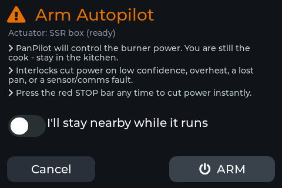
  &nbsp;
  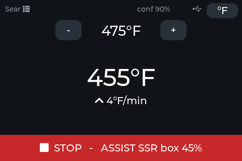
</p>

**PID autotune.** Every griddle heats differently, so PanPilot can tune its own
PID gains. From **Settings → PID autotune** (with Autopilot armed and an empty
pan on the heat), it runs a relay autotuner — briefly pulsing the burner to
induce a controlled oscillation — measures the ultimate gain and period, and
derives Ziegler-Nichols gains. It shows the result to **Save** or **Discard**;
saved gains persist and drive every later hold.

<p align="center">
  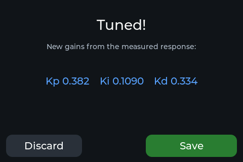
</p>

_The control logic — interlocks (S1–S11), bang-bang & PID against a simulated
plant, and the relay autotuner — is unit-tested (`test_interlocks`,
`test_controller`, `test_autotune`); the SSR box firmware is
`hardware/panpilot_ssr_box.yaml`. Live control is bench-gated on building the
box — see HARDWARE_TEST M14–M18._
## 12. Troubleshooting & FAQ _(grows per milestone)_

---

## 13. Developer appendix

- **Specs** (authoritative, read-only): `specs/panpilot-firmware-spec.md` (M0–M6),
  `specs/panpilot-phase2-to-ultimate-spec.md` (M7+). Working agreements: `CLAUDE.md`.
- **Layout:** `include/` (board pins, config, LVGL config), `src/hal` (display,
  touch, buzzer), `src/ui` (LVGL screens), `src/core` (hardware-free, unit-tested
  logic — grows M1+), `src/sensor` (thermal pipeline — M1+), `test/` (native
  Unity tests), `sim/` (LVGL SDL simulator — M0+), `scripts/`, `web/` (flasher).
- **Build & test:**
  ```bash
  pio run -e crowpanel35_advance     # firmware
  pio test -e native                 # host unit tests (runs in CI)
  ```
  Native tests run locally (MinGW-w64 GCC) and in CI; CI additionally renders
  the simulator screenshots.
- **Hardware bring-up checklist:** `HARDWARE_TEST.md`.
